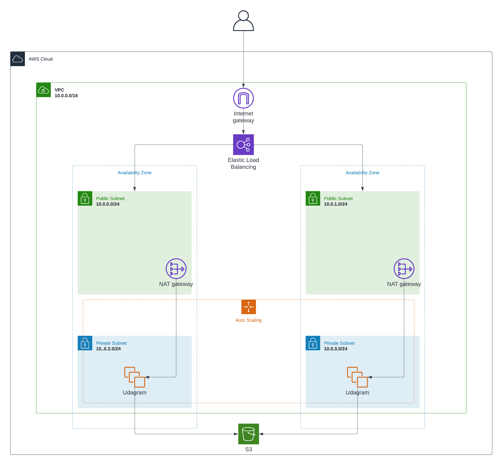

# Udacity AWS DevOps Nanodegree Project 02
```Student: Van Thong(George) Lee```

### Project Requirements

> ##### The Basics

|CRITERIA|MEETS SPECIFICATIONS|COMPLETED|
|---|---|---|
|Parameters| The more the better, but an exaggerated number of parameters can be messy ( say, 10 or more ). 1 or 0 is definitely lacking.|✅
|Resources|This is the mandatory section of the script, we are looking for a LoadBalancer, Launch Configuration, AutoScaling group a health check, security groups and a Listener and Target Group.|✅|
|Outputs|This is optional, but it would be nice to have a URL here with the Load Balancer DNS Name and “http” in front of it .|✅|
|Working Test|If the student provides a URL to verify his work is running properly, it will be a page that says “it works! Udagram, Udacity”|✅|

> ##### Load Balancer

|CRITERIA|MEETS SPECIFICATIONS|COMPLETED|
|---|---|---|
|Target Group|The auto-scaling group needs to have a property that associates it with a target group. The Load Balancer will have a Listener rule associated with the same target group|✅|
|Health Check and Listener|Port 80 should be used in Security groups, health checks and listeners associated with the load balancer|✅|

> ##### Auto-Scaling

|CRITERIA|MEETS SPECIFICATIONS|COMPLETED|
|---|---|---|
|Subnets|Students should be using PRIV-NET ( private subnets ) for their auto-scaling instances|✅|
|Machine Specs|The machine should have 10 GB or more of disk and should be a t3.small or better.|✅|
|SSH Key|There shouldn’t be a ‘keyname’ property in the launch config|✅|

> ##### Bonus

|CRITERIA|MEETS SPECIFICATIONS|COMPLETED|
|---|---|---|
|Output|Any values in the output section are a bonus|✅|
|Bastion Host|Any resource of type AWS::EC2::Instance, optional, but nice to have.|

### Diagram


---
### Website Link
http://udagram-34394902.us-east-1.elb.amazonaws.com/

---
### Screenshots of AWS Cloudformation Stacks
https://able-manuscript-d3f.notion.site/Udacity-Project-2-Cloudformation-Stack-Screenshots-5354acb11f5d44c9bb67cf49b5cb6e9b
